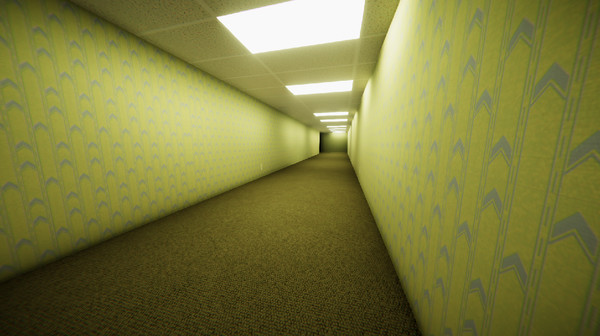

# Game Design Document

This is a placeholder for the GDD. Your team should replace the content of this
file with your own GDD from project 1, and continue to maintain it as discussed
in the project specification. 

Please **do not** update the repository from project 1, all updates to the GDD
going forward should be made to this file. **Make sure that you keep this file
named `GDD.md` and don't move it from the root directory of the repository.**
# 🕹️ COMP30019 Game Design Document (GDD)

## 🎮 Game Overview

- **Core Concept:**
The game’s name is Forsaken Voyage. The core concept of the game revolves around an escape room theme, with a focus on exploration, survival, and escape. The main idea of the game is to create a psychologically tense and oppressive experience where players need to escape from this disturbing room by finding clues and solving puzzles.
The player takes on the role of a scientist who is alone after a shipwreck. His main task is to explore the escape room he accidentally entered, survive in the disturbing environment, and look for clues to find a way to escape.

  

  Inspiration for the game's concept
https://store.steampowered.com/app/1435790/_/

  

  Inspiration from spooky elements
https://www.sohu.com/a/496870320_628730

- **Related genre(s): Portal / The backrooms**

This game is an immersive exploration game with puzzle elements. The player's goal is not only to explore the mysterious environment, but also to deal with the psychological tension brought by the eerie environment.

Games like Portal mainly focus on puzzle-solving within a monotonous environment, while games like the Back Rooms create an unsettling atmosphere through the design of space. Our game combines these two elements by incorporating both puzzle-solving and an eerie environment. Although there is only the player in the game, some breathing sounds imply the presence of other people in another dimension, which adds a sense of mystery and tension to the game. At the same time, this also creates a sense of loneliness, making the player feel depressed while maintaining tension. As the player collects clues and successfully progresses through the game, they may develop a fascination with the secrets behind this room, driven by a desire to learn the truth and escape.

  

  

  The backrooms
https://store.steampowered.com/app/1111210/The_Backrooms_Game_FREE_Edition/

  

  

  Portal
https://store.steampowered.com/app/400/Portal/

- **Target Audience:** Our target audience includes puzzle game enthusiasts, escape room enthusiasts, indie game lovers and eerie game lovers.
- **Unique Selling Points (USPs):** Our unique selling point is that, unlike traditional escape rooms which take place in different rooms within a single house, our escape room experience happens across three completely different settings. Each setting has its own atmosphere and challenges, offering players a more varied and immersive puzzle-solving experience that keeps them engaged and excited as they move through each new environment.

## 📖 Story and Narrative
- **Backstory:**
The protagonist of the game is a member of a scientific expedition team. While searching for ancient ruins, the team encounters a shipwreck. When he wakes up, he finds himself alone on an island and breaks into a breakroom. He needs to escape the room to survive... The main conflict is that after entering the house, the player’s reality and past memories get mixed up, creating a time-space confusion, and the player must find a way to escape from the eerie house.

  

  Inspiration for the game's backstory
https://steamcommunity.com/sharedfiles/filedetails/?l=schinese&id=1467214795

- **Characters:**
In our game, the player is the only active character. The backstory of the game is gradually developed through the gameplay introduction of each level. The environment and item clues in the game make the story more vivid and enrich the atmosphere of the game, even if the player is alone during the exploration.

   

  

Examples of in-game items
https://store.steampowered.com/app/501300/What_Remains_of_Edith_Finch/

## 🧩 Gameplay and Mechanics

- **Player Perspective:** The player perspective of this game is First-person perspective, because the first-person perspective could increase the immersive experience of players when they are acrossing the game environment. The camera is fixed on the first-person perspective of the players, so the discomfort caused by motion sickness might be reduced. Also, the player character will not be visible on screen.
- **Controls:** The player will control the movement through WASD keys on the keyboard, and they control forward, backward, left and right respectively. Also, the player needs to control the player perspective to move in the game world via the mouse, and the 'E' and 'Q' key on the keyboard and the left click on the mouse will allow the player to interact with the objects in the game. In addition, we set up the "P" button to pause the game and the "R" button to restart the current level.

  

    (Made on the Canva platform)

- **Progression:** The game will progress with the story and the clues collected by the player.
    - The player needs to open the door of the escape room to escape (game level) and go to the next level until the player successfully escapes from the escape room.
    - In the game level, the player might face the mental challenge and be nervous under the game atmosphere and the exploration for the useful clues and the objects to help themselves to escape from the escape room. Also, when the player enters into the game level, there might be the time limit for the player to solve the puzzles, and if the player cannot solve the puzzles they will not escape from the escape room successfully and they will lose the game.
  
- **Gameplay Mechanics:**
    - The actions that the player could take are movement under the fixed speed (including forward, backward, left and right), and the interaction between the objects in the game via ‘E’ and 'Q' keys on the keyboard.
    - Players need to solve the puzzles so that they might obtain the key clues or objects. We consider designing a variety of puzzles in different game levels which might present different parts of the game story.
    - The core mechanics of this game are exploring the key clues and solving puzzles, and we might present the eerie game atmosphere via the eerie puzzles or objects and environment to make the game meaningful and interesting, so that players might feel eerie and creepy when they experience the game.
    - Players play in the order of the levels, and each level is free to explore so that players can find clues and objects at their own pace.

## 🌍 Levels and World Design

- **Game World:** The game world of our game will be captured on screen via 3D format, and the game will display with a single screen. The player will experience multiple game levels (we consider about 3 levels), and we consider adding the game guidance to navigate through the game via clues and the objects that the player found in the game world. We will not provide the map to players, the player needs to explore by themselves in the specific game level and the space of each level might not be too large.

  **Level 1:** The player appears in a dormitory room with a broken photo on the wall. The player needs to piece together the fragments to complete the image and pass the level.

  **Level 2:** The player arrives at the hospital where they were treated and searches for clues hidden in four medical reports to unlock a four-digit code door.

  **Level 3:** In the final level, the player enters a maze and needs to find a key hidden behind a red door in order to open the final black door and successfully complete it.

  

    The game level inner layout may refer to Thalassa: Edge of the Abyss
    https://store.steampowered.com/app/1783680/Thalassa_Edge_of_the_Abyss/

- **Objects:** The game objects that we will cover in the game level will base on the game story (backstory) and the each level’s progress plan, such as broken photos that need to be puzzled, medical examination reports that may contain key information or help players escape from the secret room. Some items allow players to interact with them, and some items are just decorations of the game world. When the player approaches and observes the items, the interactive items will have text prompts to let the player know that these items can be interacted with. The interactive objects might interact with each other via the logic of the clues or storyline.

  

    (Refer to Thalassa: Edge of the Abyss)
    https://store.steampowered.com/app/1783680/Thalassa_Edge_of_the_Abyss/

- **Physics:** Other physics in the game such as the ‘doors, walls, cabinets’ will follow the basic physics regularity on the earth.

## 🎨 Art and Audio
- **Art Style:**
The art style of the game is mainly to create a psychological horror atmosphere, with the environment mainly in shades of grey, black, and dark blue. The character will turn red at the last 10 seconds to indicate that the game is about to end.

  
   
  <em>Game background-1</em>
   
  <a href="https://store.steampowered.com/app/1943950/Escape_the_Backrooms/">Escape the Backrooms</a>

  
   
  <em>Game background-2</em>
   
  <a href="https://store.steampowered.com/app/1943950/Escape_the_Backrooms/">Escape the Backrooms</a>

  
   
  <em>In-game scenes</em>
   
  <a href="https://store.steampowered.com/app/1946700/Layers_of_Fear/">layers of Fear</a>

- **Sound and Music:**
We will add ambient sound effects to create a constant sense of unease. To increase the player's freedom of control over the game, the player can adjust the volume in the menu. In addition, to deepen the player's immersion in the horror scene, we hope that this soundscape will combine traditional and modern elements to complement the game's weird and cultural appearance.

- **Assets:**
A variety of environment models, textures, sound effects, and music that complement the game's psychological terror will be included in the artistic materials. Models of the environment, will be sourced from the [Unity Asset Store](https://assetstore.unity.com/) will provide models of contemporary scientific equipment for seamless integration. Using [Quixel Megascans](https://quixel.com/megascans/home) and [Quixel Bridge](https://quixel.com/bridge), textures for walls, floors, and objects with an emphasis on decay will be sourced and further enhanced in Photoshop. In order to ensure maximum compatibility, sound assets—such as background noises like distant echoes and creaking wood—will be acquired from [Freesound](https://freesound.org/). Additional alternatives can be found via the [Unity Asset Store](https://assetstore.unity.com/). The soundtrack, which combines modern to create a spooky melody, will be either specially written in FL Studio or purchased for quick implementation from the [Unity Asset Store](https://assetstore.unity.com/). These materials will be carefully chosen to produce a creepy, richly cultural, and immersive environment that improves the entire gaming experience.
## 🖥️ User Interface (UI)

- **Menu Screen:** Including game name, and buttons: Start, Setting and Instruction. These three buttons are the core functions of the menu, simple and clear. The "Instructions" button is used to display the game's operating instructions, and players can adjust the volume control through the "setting" button.

- **Game Play Screen:** Show Timer Count in for each level of the game. The funnel represents the countdown of the timer, allowing players to intuitively feel the passage of time. 

  
     
        <em>Wireframe 2 - Game Play Screen</em>
     

- **Game Over:** When the game ends, a message "Game Over! Press R to start" will appear in the center of the screen. This text is bold and large in font and placed in the center of the screen to remind players of the game progress and require them to respond. The "Resume" button helps players who fail to pass the level within the time limit to start over. The "Exit" button can help players who do not want to continue the game to exit the game.

  
     
        <em>Wireframe 3 - Game Over</em>
     

## 🛠️ Technology and Tools

- **Unity (Version 2022.3.x):** Unity, as a versatile and widely used game engine, contains many plug-ins that can help us make 3D games more easily. And Unity has a lot of community support and tutorials, and rich resources for learning how to use it.
- **GitHub Desktop (Version 3.4.2):** We develop games through teamwork and will face iterative updates of game versions. Github allows multiple team members to work on the same project at the same time and track code and assets. GitHub's branch and pull request system allows code changes to be reviewed before they are made, allowing for efficient version control, and it also has powerful backup capabilities to prevent data loss.
- **Visual Studio Code (Version 1.84.2):** Visual Studio Code can be used to write and debug C# scripts, and run games by combining with Unity. Visual Studio Code is an excellent IDE with many extensions to assist in code writing, which can improve efficiency and accuracy.
Link: https://code.visualstudio.com/
- **CapCut:** CapCut is a video and audio editing tool suitable for creating cutscenes and editing sound effects and audio required for games. We chose CapCut because it is user-friendly and has an intuitive interface. People with almost no video editing experience can easily get started, saving learning costs.
Link: https://www.capcut.com/

## 📋 Team Communication, Timeline, and Project Management

When assigning work to the team, we assign positions according to the team members' skills and specialties, to strive for everyone to do what they are good at and make the game present the best results. We use different communication tools to increase team efficiency. 
- **Daily communication:** We use WeChat's group chat function to ensure everyone can receive and reply to messages in time.
- **Meetings:** We use Zoom to facilitate everyone to collaborate and share screens.
- **Game design and development:** We choose Google Documents and Github to share documents and codes to improve efficiency. 
- **Project management:** We use Trello and create a Kanban board to set and assign tasks and deadlines to team members at each stage and check the tasks on the Kanban Board when they are completed.

## 🚧 Possible Challenges
We will face some potential challenges in the process of developing the game. First, there is insufficient development time. 
- **Lack of time:** The team members are all full-time students with busy schedules and do not have enough time to invest in game development. In addition, the required development time is short, only two months, which will pose a challenge to the timely delivery of the game. 
- **Technical limitations:** As students, the team members lack experience in game development and application practice of game development technology, which may lead to the inability to implement certain gameplay or the inability to run the game smoothly on different platforms. 
- **Lack of experience:** The team lacks experience in project management, which may lead to insufficient game quality or inefficient teamwork.

## Reference
In the jigsaw level, the online Unity tutorial is referenced.
